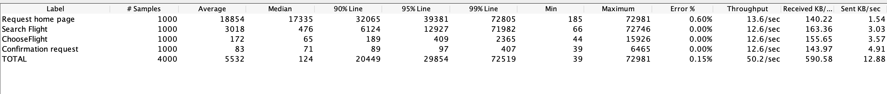

# Load Test Summary and Results

**Website under test:** www.blazedemo.com
**No. of users/threads simulated:** 1000
**Server Capacity:** Unknown
**No.of instances of service**: Unknown
**Additional hardware coonfigurations**: Unknown
**Test data:** Random data generated using available JMeter functionality.

**Targetted endpoints of the site:**

1. /
2. /reserve.php
3. /purchase.php
4. /confirmation.php

###Summary:
**Response times:** (in seconds)
Average : 5.53
Fast : 0.039
Slow : 72.98

**Error rate:**
Error rate is at 0.6% for a 1000 user sample. All errors are from Home page requests.

Attached Results from a 1000 user sample.

